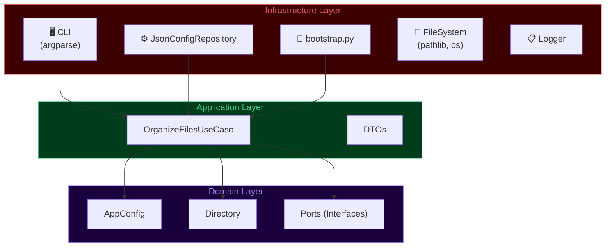

```mermaid
graph TD
    CLI["🖥️ CLI\n(argparse)"]
    CONFIG["⚙️ JsonConfigRepository"]
    BOOTSTRAP["🔧 bootstrap.py"]

    subgraph INFRA["Infrastructure Layer"]
        CLI
        CONFIG
        BOOTSTRAP
        FS["📁 FileSystem\n(pathlib, os)"]
        LOG["📋 Logger"]
    end

    subgraph APP["Application Layer"]
        UC["OrganizeFilesUseCase"]
        DTO["DTOs"]
    end

    subgraph DOMAIN["Domain Layer"]
        CFG["AppConfig"]
        DIR["Directory"]
        PORTS["Ports (Interfaces)"]
    end

    CLI --> UC
    CONFIG --> UC
    BOOTSTRAP --> UC
    UC --> CFG
    UC --> DIR
    UC --> PORTS

    style INFRA fill:#3d0000,stroke:#e05a5a,color:#e05a5a
    style APP fill:#003d1a,stroke:#4ec994,color:#4ec994
    style DOMAIN fill:#1a003d,stroke:#a78bfa,color:#a78bfa
```