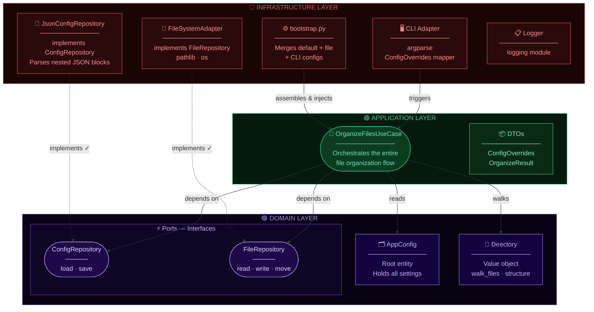

# 🗂️ File Organizer — Architecture

> Hexagonal Architecture (Ports & Adapters) with DDD principles.
> Dependencies always point **inward** — outer layers know about inner layers, never the reverse.

---

## Architecture Diagram



---

## Layer Responsibilities

### 🔴 Infrastructure Layer

Handles all external concerns — file system, CLI input, JSON config files, logging.
This is the only layer that knows about the outside world.

| Component              | Responsibility                                            |
| ---------------------- | --------------------------------------------------------- |
| `CLI Adapter`          | Parses `argparse` arguments → maps to `ConfigOverrides`   |
| `bootstrap.py`         | Merges default config + JSON file + CLI overrides         |
| `JsonConfigRepository` | Implements `ConfigRepository` port, reads/writes JSON     |
| `FileSystemAdapter`    | Implements `FileRepository` port using `pathlib` and `os` |
| `Logger`               | Application-wide logging via Python `logging` module      |

### 🟢 Application Layer

Orchestrates the use cases. Knows about Domain, but not about Infrastructure.

| Component              | Responsibility                                              |
| ---------------------- | ----------------------------------------------------------- |
| `OrganizeFilesUseCase` | Main use case — runs the full file organization flow        |
| `DTOs`                 | `ConfigOverrides`, `OrganizeResult` — data transfer objects |

### 🟣 Domain Layer

Pure business logic. No dependencies on any other layer.

| Component          | Responsibility                                        |
| ------------------ | ----------------------------------------------------- |
| `AppConfig`        | Root entity — holds all configuration settings        |
| `Directory`        | Value object — `walk_files()`, directory structure    |
| `ConfigRepository` | **Port** — interface for loading/saving config        |
| `FileRepository`   | **Port** — interface for reading/writing/moving files |

---

## Key Rule — Dependency Direction

```
Infrastructure  →  Application  →  Domain
     (knows about)    (knows about)   (knows nothing)
```

> Solid arrows `→` = **depends on**
> Dashed arrows `-.->` = **implements** (adapter fulfills a port contract)
