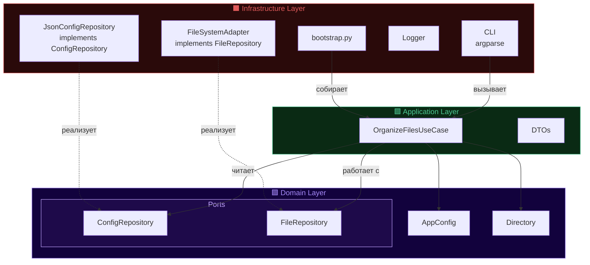

```mermaid
graph TB
    subgraph INFRA["⬛ Infrastructure Layer"]
        CLI["CLI\nargparse"]
        JSON["JsonConfigRepository\nimplements ConfigRepository"]
        FS["FileSystemAdapter\nimplements FileRepository"]
        LOG["Logger"]
        BOOT["bootstrap.py"]
    end

    subgraph APP["🟩 Application Layer"]
        UC["OrganizeFilesUseCase"]
        DTO["DTOs"]
    end

    subgraph DOMAIN["🟪 Domain Layer"]
        CFG["AppConfig"]
        DIR["Directory"]
        subgraph PORTS["Ports"]
            P1["ConfigRepository"]
            P2["FileRepository"]
        end
    end

    CLI -->|"вызывает"| UC
    BOOT -->|"собирает"| UC
    UC -->|"читает"| P1
    UC -->|"работает с"| P2
    UC --> CFG
    UC --> DIR
    JSON -.->|"реализует"| P1
    FS  -.->|"реализует"| P2

    style INFRA fill:#2a0a0a,stroke:#e05a5a,color:#e05a5a
    style APP   fill:#0a2a14,stroke:#4ec994,color:#4ec994
    style DOMAIN fill:#12023d,stroke:#a78bfa,color:#a78bfa
    style PORTS fill:#1e0a4a,stroke:#c4a8ff,color:#c4a8ff
```